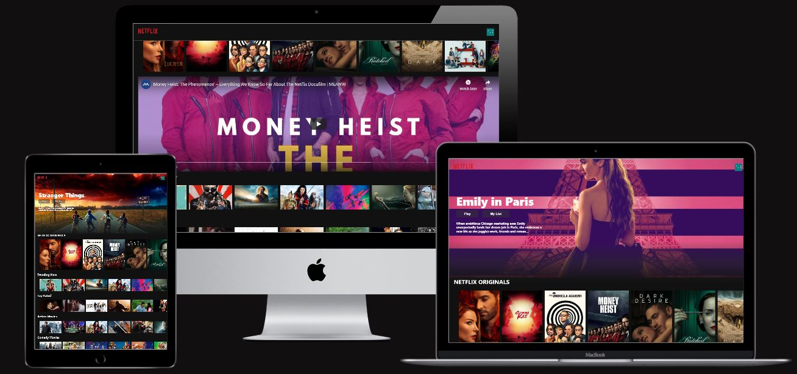

# Netflix Clone

This is a front-end clone of Netflix that displays the trailers and is deployed using [Firebase](https://firebase.google.com/).

# Technolgies Used:

- [Visual Studio Code](https://code.visualstudio.com/)

- [Nodejs](https://nodejs.org/en/)

- [Reactjs](https://reactjs.org/)

- [React Youtube](https://www.npmjs.com/package/react-youtube)
- [Axios](https://www.npmjs.com/package/axios)

- [The Movie Database](https://www.themoviedb.org/)

# Deploy to Firebase:

- firebase login
- firebase init
  - Hosting
  - Use existing project
  - build
  - Y

* npm run buid
* firebase deploy

# Bug:

Not all of the trailers diplay when you click on an image. I am still trying to resolve it and currently my research has advised this is current issue with the technology.

# Credits

[Clever Programmer-Netflix-Clone Youtube](https://www.youtube.com/channel/UCqrILQNl5Ed9Dz6CGMyvMTQ)
